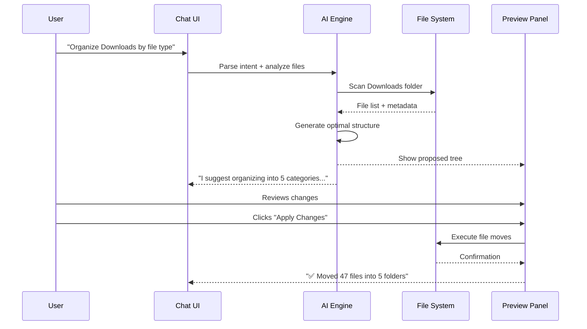
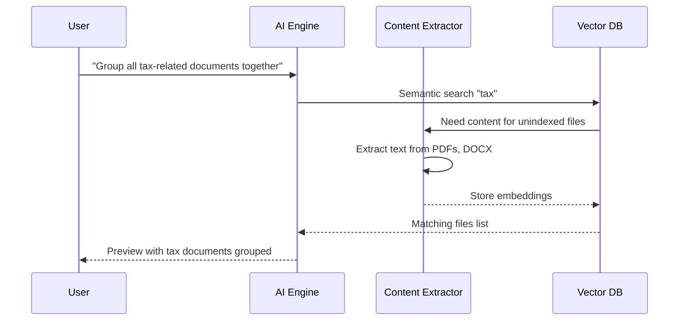

# Smart Storage AI - Technical Specification

> **Version:** 0.1.0-draft  
> **Last Updated:** December 2025  
> **Status:** Planning Phase  
> **License:** AGPLv3 (Open Core Model)

---

## 📋 Table of Contents

1. [Executive Summary](#executive-summary)
2. [Product Vision](#product-vision)
3. [User Experience](#user-experience)
4. [Technical Architecture](#technical-architecture)
5. [AI Components](#ai-components)
6. [Platform Support](#platform-support)
7. [Security & Privacy](#security--privacy)
8. [Development Phases](#development-phases)
9. [Monetization](#monetization)
10. [Technology Stack](#technology-stack)
11. [API Reference](#api-reference)
12. [File Formats](#file-formats)
13. [Testing Strategy](#testing-strategy)
14. [Deployment](#deployment)
15. [Contributing](#contributing)

---

## Executive Summary

**Smart Storage AI** is a privacy-first, fully local AI-powered file organization application. It enables users to reorganize their entire file system through natural language chat, with a live preview of changes before applying them.

### Key Differentiators

| Feature | Smart Storage AI | Competitors |
|---------|------------------|-------------|
| Fully local (no cloud) | ✅ | ⚠️ Some |
| Android native support | ✅ | ❌ |
| Tiny AI models (~130MB total) | ✅ | ❌ (use 3-7GB) |
| Natural language chat | ✅ | ❌ |
| Live preview before apply | ✅ | ⚠️ Basic |
| Content understanding | ✅ | ⚠️ Limited |
| Open source (AGPLv3) | ✅ | ⚠️ Some |

### Target Users

- Privacy-conscious individuals
- Users with large disorganized file collections
- Professionals managing documents across devices
- Anyone who wants AI assistance without cloud dependency

---

## Product Vision

### Problem Statement

Users accumulate thousands of files across devices with no consistent organization. Existing solutions either:
- Require cloud uploads (privacy concern)
- Use massive AI models (resource intensive)
- Lack natural language interface
- Don't show preview before changes
- Are desktop-only

### Solution

A lightweight, fully local AI assistant that:
1. Understands natural language requests ("organize my downloads by project")
2. Analyzes file content (text, images, audio)
3. Shows proposed reorganization before applying
4. Works across all platforms with same experience
5. Fits in ~130-350MB total

### Core Principles

1. **Privacy First** - Zero network calls, all AI on-device
2. **Transparency** - Open source, auditable, reproducible builds
3. **Efficiency** - Tiny models, fast performance, low battery
4. **Safety** - Preview before apply, full undo/rollback
5. **Universal** - Same experience on Android, Windows, Mac, Linux

---

## User Experience

### Main Interface Layout

```
┌─────────────────────────────────────────────────────────────────────┐
│  ☰  SMART STORAGE AI                              [Settings] [?]   │
├─────────────────────────────────┬───────────────────────────────────┤
│                                 │                                   │
│  📁 CURRENT FILE BROWSER        │  💬 AI ASSISTANT                  │
│  ─────────────────────────────  │  ───────────────────────────────  │
│  Storage: Internal ▼            │                                   │
│                                 │  Welcome! I can help you:         │
│  ├── 📁 Downloads/              │  • Organize files by type/date    │
│  │   ├── 📄 report_final.pdf    │  • Find specific documents        │
│  │   ├── 🖼️ IMG_20240315.jpg    │  • Suggest better structure       │
│  │   ├── 🎵 podcast_ep42.mp3    │  • Clean up duplicates            │
│  │   └── 📄 invoice_march.pdf   │                                   │
│  ├── 📁 Documents/              │  ─────────────────────────────    │
│  │   └── ...                    │                                   │
│  └── 📁 DCIM/                   │  [User message input...]     [▶]  │
│      └── ...                    │                                   │
│                                 │                                   │
├─────────────────────────────────┤                                   │
│                                 │                                   │
│  👁️ PREVIEW (Proposed Changes)  │                                   │
│  ─────────────────────────────  │                                   │
│  Status: Ready                  │                                   │
│                                 │                                   │
│  (Changes will appear here     │                                   │
│   after AI processes request)   │                                   │
│                                 │                                   │
│  [✅ Apply Changes] [❌ Cancel]  │                                   │
│  [🔄 Modify] [↩️ Undo Last]      │                                   │
│                                 │                                   │
└─────────────────────────────────┴───────────────────────────────────┘
```

### User Flow: Basic Reorganization



### User Flow: Content-Based Organization



### Chat Commands (Natural Language)

Users can say things like:

**Organization:**
- "Organize my downloads by file type"
- "Sort photos by year and month"
- "Group work documents separately from personal"
- "Create a project folder structure for [project name]"

**Search:**
- "Find all documents mentioning 'invoice'"
- "Show me large files over 100MB"
- "Where are my tax documents from 2023?"

**Analysis:**
- "What's taking up the most space?"
- "Show me duplicate files"
- "Which folders haven't been accessed in a year?"

**Suggestions:**
- "How should I organize this mess?"
- "Suggest a better folder structure"
- "What files can I safely delete?"

---

## Technical Architecture

### High-Level Architecture

```
┌─────────────────────────────────────────────────────────────────────┐
│                         APPLICATION LAYER                           │
│  ┌─────────────┐  ┌─────────────┐  ┌─────────────┐                 │
│  │   Chat UI   │  │ File Browser│  │   Preview   │                 │
│  │  (Reactive) │  │   (Tree)    │  │   (Diff)    │                 │
│  └──────┬──────┘  └──────┬──────┘  └──────┬──────┘                 │
│         │                │                │                         │
│         └────────────────┼────────────────┘                         │
│                          │                                          │
├──────────────────────────┼──────────────────────────────────────────┤
│                    CORE SERVICES LAYER                              │
│                          │                                          │
│  ┌───────────────────────┼───────────────────────────┐             │
│  │              State Manager (Reactive)             │             │
│  └───────────────────────┬───────────────────────────┘             │
│                          │                                          │
│  ┌──────────┐  ┌─────────┴─────────┐  ┌──────────┐                 │
│  │  Intent  │  │  Organization     │  │  Search  │                 │
│  │  Parser  │  │  Engine (TRM)     │  │  Engine  │                 │
│  └────┬─────┘  └─────────┬─────────┘  └────┬─────┘                 │
│       │                  │                 │                        │
├───────┼──────────────────┼─────────────────┼────────────────────────┤
│                       AI LAYER                                      │
│       │                  │                 │                        │
│  ┌────┴─────┐  ┌─────────┴─────────┐  ┌───┴────┐                   │
│  │ SmolLM   │  │      TRM          │  │Embed   │                   │
│  │ 135M     │  │      7M           │  │Model   │                   │
│  │(Language)│  │  (Reasoning)      │  │ 50M    │                   │
│  └────┬─────┘  └─────────┬─────────┘  └───┬────┘                   │
│       │                  │                │                         │
├───────┴──────────────────┴────────────────┴─────────────────────────┤
│                    CONTENT EXTRACTION LAYER                         │
│                                                                     │
│  ┌─────────┐ ┌─────────┐ ┌─────────┐ ┌─────────┐ ┌─────────┐      │
│  │  Text   │ │   PDF   │ │  DOCX   │ │  Image  │ │  Audio  │      │
│  │ Reader  │ │ Extract │ │ Extract │ │  CLIP   │ │ Whisper │      │
│  │  ~0MB   │ │  ~5MB   │ │  ~3MB   │ │  ~50MB  │ │  ~75MB  │      │
│  └────┬────┘ └────┬────┘ └────┬────┘ └────┬────┘ └────┬────┘      │
│       │          │          │          │          │               │
├───────┴──────────┴──────────┴──────────┴──────────┴───────────────┤
│                      DATA LAYER                                    │
│                                                                    │
│  ┌──────────────────────┐  ┌──────────────────────┐               │
│  │    SQLite + VSS      │  │    Change Log        │               │
│  │  (Content Index)     │  │    (Undo History)    │               │
│  └──────────────────────┘  └──────────────────────┘               │
│                                                                    │
├────────────────────────────────────────────────────────────────────┤
│                    PLATFORM ABSTRACTION LAYER                      │
│                                                                    │
│  ┌─────────┐ ┌─────────┐ ┌─────────┐ ┌─────────┐ ┌─────────┐     │
│  │ Android │ │ Windows │ │  MacOS  │ │  Linux  │ │   iOS   │     │
│  │  SAF    │ │  Native │ │ Native  │ │ Native  │ │Sandboxed│     │
│  └─────────┘ └─────────┘ └─────────┘ └─────────┘ └─────────┘     │
│                                                                    │
└────────────────────────────────────────────────────────────────────┘
```

### Component Details

#### 1. Intent Parser (SmolLM 135M)

Converts natural language to structured commands.

**Input:**
```
"Organize my downloads folder by file type, separate work from personal"
```

**Output:**
```json
{
  "action": "REORGANIZE",
  "target": {
    "path": "/storage/emulated/0/Download",
    "recursive": true
  },
  "criteria": [
    {"type": "FILE_TYPE", "priority": 1},
    {"type": "CATEGORY", "values": ["work", "personal"], "priority": 2}
  ],
  "options": {
    "preserve_dates": true,
    "handle_duplicates": "ask"
  }
}
```

#### 2. Organization Engine (TRM 7M)

Solves the file organization as a constraint satisfaction problem.

**Input:**
```json
{
  "files": [
    {"path": "report.pdf", "type": "pdf", "category": "work", "size": 1024000},
    {"path": "vacation.jpg", "type": "image", "category": "personal", "size": 2048000}
  ],
  "criteria": ["FILE_TYPE", "CATEGORY"],
  "constraints": {
    "max_depth": 3,
    "min_files_per_folder": 2
  }
}
```

**Output:**
```json
{
  "structure": {
    "Work": {
      "Documents": ["report.pdf"]
    },
    "Personal": {
      "Images": ["vacation.jpg"]
    }
  },
  "moves": [
    {"from": "report.pdf", "to": "Work/Documents/report.pdf"},
    {"from": "vacation.jpg", "to": "Personal/Images/vacation.jpg"}
  ]
}
```

#### 3. Content Extraction Pipeline

```
┌─────────────────────────────────────────────────────────────────┐
│                    FILE CONTENT EXTRACTION                       │
├─────────────────────────────────────────────────────────────────┤
│                                                                 │
│  Input File ──┬── Text? (.txt, .md, .py, .json, etc.)          │
│               │   └── Direct read → Text content                │
│               │                                                 │
│               ├── PDF? (.pdf)                                   │
│               │   └── PyMuPDF → Text + metadata                 │
│               │                                                 │
│               ├── Office? (.docx, .xlsx, .pptx)                 │
│               │   └── python-docx/openpyxl → Text + structure   │
│               │                                                 │
│               ├── Image? (.jpg, .png, .webp)                    │
│               │   ├── MobileCLIP → Semantic description         │
│               │   └── Tesseract (optional) → OCR text           │
│               │                                                 │
│               ├── Audio? (.mp3, .wav, .m4a)                     │
│               │   └── Whisper tiny → Transcription              │
│               │                                                 │
│               └── Other                                         │
│                   └── Metadata only (name, size, date)          │
│                                                                 │
│  Output: {                                                      │
│    "path": "/path/to/file",                                     │
│    "content_summary": "Quarterly sales report...",              │
│    "keywords": ["sales", "Q3", "revenue"],                      │
│    "category_hints": ["work", "finance"],                       │
│    "embedding": [0.123, -0.456, ...]                            │
│  }                                                              │
│                                                                 │
└─────────────────────────────────────────────────────────────────┘
```

#### 4. Vector Database (SQLite + VSS)

Schema:
```sql
-- Main files table
CREATE TABLE files (
    id INTEGER PRIMARY KEY,
    path TEXT UNIQUE NOT NULL,
    filename TEXT NOT NULL,
    extension TEXT,
    size INTEGER,
    created_at INTEGER,
    modified_at INTEGER,
    accessed_at INTEGER,
    content_hash TEXT,
    content_summary TEXT,
    keywords TEXT,  -- JSON array
    category_hints TEXT,  -- JSON array
    indexed_at INTEGER
);

-- Vector embeddings (using sqlite-vss)
CREATE VIRTUAL TABLE file_embeddings USING vss0(
    embedding(384)  -- Dimension depends on embedding model
);

-- Change history for undo
CREATE TABLE change_log (
    id INTEGER PRIMARY KEY,
    timestamp INTEGER NOT NULL,
    operation TEXT NOT NULL,  -- MOVE, RENAME, DELETE, CREATE_FOLDER
    source_path TEXT,
    dest_path TEXT,
    metadata TEXT,  -- JSON with additional info
    batch_id TEXT,  -- Group related changes
    undone INTEGER DEFAULT 0
);

-- User preferences
CREATE TABLE preferences (
    key TEXT PRIMARY KEY,
    value TEXT
);

-- Custom organization rules
CREATE TABLE rules (
    id INTEGER PRIMARY KEY,
    name TEXT NOT NULL,
    conditions TEXT NOT NULL,  -- JSON
    actions TEXT NOT NULL,     -- JSON
    priority INTEGER DEFAULT 0,
    enabled INTEGER DEFAULT 1
);
```

---

## AI Components

### Model Selection Rationale

| Component | Model | Size | Why This Choice |
|-----------|-------|------|-----------------|
| Chat/Intent | SmolLM 135M | ~100MB | Smallest capable language model |
| Organization | TRM | 7MB | Purpose-built for reasoning/constraints |
| Embeddings | all-MiniLM-L6-v2 | ~50MB | Good quality, small size |
| Image | MobileCLIP | ~50MB | Mobile-optimized CLIP |
| OCR | Tesseract | ~30MB | Industry standard, offline |
| Audio | Whisper tiny | ~75MB | Best tiny speech model |

### TRM Training for File Organization

TRM needs custom training for file organization tasks.

**Training Data Format:**
```json
{
  "input": {
    "files": [
      {"name": "IMG_2024_vacation.jpg", "type": "image", "size": 2048000},
      {"name": "quarterly_report.pdf", "type": "pdf", "size": 512000},
      {"name": "song.mp3", "type": "audio", "size": 4096000}
    ],
    "criteria": ["type"],
    "constraints": {"max_depth": 2}
  },
  "output": {
    "structure": {
      "Images": ["IMG_2024_vacation.jpg"],
      "Documents": ["quarterly_report.pdf"],
      "Audio": ["song.mp3"]
    }
  }
}
```

**Training Data Generation Strategy:**
1. Generate synthetic file lists with realistic names
2. Create ground truth organizations manually
3. Augment with variations (different naming patterns)
4. Include edge cases (conflicts, duplicates, deep nesting)

**Estimated Training:**
- ~10,000 examples
- ~4-8 hours on single GPU
- Cost: ~$5-20 on cloud GPU

### Inference Pipeline

```
User Input
    │
    ▼
┌─────────────────────────────────────────┐
│  1. SmolLM: Parse Intent                │
│     "organize by type" → {action, ...}  │
│     Latency: ~200ms                     │
└─────────────────────────────────────────┘
    │
    ▼
┌─────────────────────────────────────────┐
│  2. File Scanner: Collect Metadata      │
│     Scan target folder, extract info    │
│     Latency: depends on file count      │
└─────────────────────────────────────────┘
    │
    ▼
┌─────────────────────────────────────────┐
│  3. Content Extractor (if needed)       │
│     Extract text from PDFs, images      │
│     Latency: ~500ms per file            │
└─────────────────────────────────────────┘
    │
    ▼
┌─────────────────────────────────────────┐
│  4. TRM: Generate Organization          │
│     Solve constraint satisfaction       │
│     Latency: ~100-500ms                 │
└─────────────────────────────────────────┘
    │
    ▼
┌─────────────────────────────────────────┐
│  5. SmolLM: Generate Response           │
│     Create human-readable explanation   │
│     Latency: ~300ms                     │
└─────────────────────────────────────────┘
    │
    ▼
Preview UI
```

---

## Platform Support

### Android Implementation

**File Access:**
```kotlin
// Using Storage Access Framework (SAF)
val intent = Intent(Intent.ACTION_OPEN_DOCUMENT_TREE)
startActivityForResult(intent, REQUEST_CODE)

// Or MediaStore for media files
val projection = arrayOf(
    MediaStore.Files.FileColumns._ID,
    MediaStore.Files.FileColumns.DISPLAY_NAME,
    MediaStore.Files.FileColumns.SIZE,
    MediaStore.Files.FileColumns.MIME_TYPE
)
```

**Permissions Required:**
```xml
<uses-permission android:name="android.permission.READ_EXTERNAL_STORAGE" />
<uses-permission android:name="android.permission.WRITE_EXTERNAL_STORAGE" />
<uses-permission android:name="android.permission.MANAGE_EXTERNAL_STORAGE" />
```

**AI Runtime:**
- ONNX Runtime for Android
- TensorFlow Lite as fallback
- Native ARM optimizations

### Desktop Implementation (Windows/Mac/Linux)

**Framework:** Tauri (Rust backend, Web frontend)

**Advantages:**
- ~10MB runtime (vs ~150MB Electron)
- Native performance
- Single codebase
- Good security model

**File Access:**
```rust
// Rust backend - full native access
use std::fs;
use walkdir::WalkDir;

fn scan_directory(path: &str) -> Vec<FileInfo> {
    WalkDir::new(path)
        .into_iter()
        .filter_map(|e| e.ok())
        .map(|e| FileInfo::from_path(e.path()))
        .collect()
}
```

### Cross-Platform AI Runtime

```
┌─────────────────────────────────────────────────────────────────┐
│                    AI RUNTIME ABSTRACTION                        │
├─────────────────────────────────────────────────────────────────┤
│                                                                 │
│  ┌─────────────────────────────────────────────────────────┐   │
│  │              Unified Model Interface                     │   │
│  │  load_model(path) -> Model                              │   │
│  │  infer(model, input) -> Output                          │   │
│  └─────────────────────────────────────────────────────────┘   │
│                           │                                     │
│           ┌───────────────┼───────────────┐                    │
│           │               │               │                    │
│           ▼               ▼               ▼                    │
│  ┌─────────────┐ ┌─────────────┐ ┌─────────────┐              │
│  │    ONNX     │ │   TFLite    │ │  llama.cpp  │              │
│  │   Runtime   │ │   Runtime   │ │  (for LLM)  │              │
│  └─────────────┘ └─────────────┘ └─────────────┘              │
│                                                                 │
│  Platform Detection:                                           │
│  - Android ARM64 → TFLite + NNAPI                              │
│  - Android x86 → ONNX Runtime                                  │
│  - Desktop → ONNX Runtime (CPU/GPU)                            │
│  - Apple Silicon → CoreML via ONNX                             │
│                                                                 │
└─────────────────────────────────────────────────────────────────┘
```

---

## Security & Privacy

### Zero Network Architecture

```
┌─────────────────────────────────────────────────────────────────┐
│                    NETWORK ISOLATION                             │
├─────────────────────────────────────────────────────────────────┤
│                                                                 │
│  Application Start:                                             │
│  1. Check network permissions = NONE                            │
│  2. All AI models bundled in APK/app                            │
│  3. No update mechanism that phones home                        │
│  4. Updates only via app store                                  │
│                                                                 │
│  Runtime Guarantees:                                            │
│  - No DNS lookups                                               │
│  - No HTTP/HTTPS calls                                          │
│  - No socket connections                                        │
│  - No WebView with network access                               │
│                                                                 │
│  Verification:                                                  │
│  - Build from source                                            │
│  - Network traffic monitoring                                   │
│  - Static analysis of APK                                       │
│  - Reproducible builds                                          │
│                                                                 │
└─────────────────────────────────────────────────────────────────┘
```

### Data Protection

```
┌─────────────────────────────────────────────────────────────────┐
│                    DATA PROTECTION                               │
├─────────────────────────────────────────────────────────────────┤
│                                                                 │
│  Content Index (SQLite):                                        │
│  ┌─────────────────────────────────────────────────────────┐   │
│  │  Option 1: Unencrypted (default)                         │   │
│  │  - Faster performance                                    │   │
│  │  - Relies on device encryption                           │   │
│  │                                                          │   │
│  │  Option 2: SQLCipher (Pro feature)                       │   │
│  │  - AES-256 encryption                                    │   │
│  │  - User-provided passphrase                              │   │
│  │  - ~10-15% performance overhead                          │   │
│  └─────────────────────────────────────────────────────────┘   │
│                                                                 │
│  Sensitive Data Handling:                                       │
│  - Content summaries can be disabled                           │
│  - Embeddings are not human-readable                           │
│  - Original files never modified (only moved)                  │
│  - Full audit log with optional auto-purge                     │
│                                                                 │
│  User Control:                                                  │
│  - Exclude folders from scanning                               │
│  - Delete all indexed data anytime                             │
│  - Export/import preferences only (no file data)               │
│                                                                 │
└─────────────────────────────────────────────────────────────────┘
```

### Threat Model

| Threat | Mitigation |
|--------|------------|
| Malicious app update | Open source, reproducible builds, multiple distribution channels |
| Data exfiltration | Zero network access, verifiable |
| Local malware accessing index | Device-level encryption, optional SQLCipher |
| Accidental data loss | Comprehensive undo system, confirmation before changes |
| Unintended file organization | Preview before apply, batch undo |

---

## Development Phases

### Phase 1: Foundation (MVP)

**Duration:** 4-6 weeks  
**Goal:** Working Android app with basic organization

**Features:**
- [ ] Basic file browser UI (current tree view)
- [ ] Preview panel (proposed changes view)
- [ ] Simple chat interface
- [ ] Rule-based organization (by type, date, size)
- [ ] File move operations with undo
- [ ] SQLite database for history

**Tech Stack:**
- Tauri Mobile (Rust + WebView)
- SolidJS or Svelte (lightweight, reactive)
- SQLite (no AI yet)

**No AI in Phase 1** - Uses deterministic rules only

### Phase 2: AI Chat

**Duration:** 3-4 weeks  
**Goal:** Natural language understanding

**Features:**
- [ ] SmolLM 135M integration
- [ ] Intent parsing from natural language
- [ ] Response generation
- [ ] ONNX Runtime setup

**Training Required:** None (use pretrained SmolLM)

### Phase 3: Content Extraction

**Duration:** 3-4 weeks  
**Goal:** Understand file contents

**Features:**
- [ ] Text file reading
- [ ] PDF extraction (PyMuPDF via wasm or native)
- [ ] DOCX extraction
- [ ] Embedding generation
- [ ] Vector search (semantic "find documents about X")

### Phase 4: Smart Organization (TRM)

**Duration:** 4-6 weeks  
**Goal:** AI-powered organization decisions

**Features:**
- [ ] TRM model training
- [ ] Integration with organization engine
- [ ] Conflict resolution
- [ ] Priority handling
- [ ] Learning user preferences

**Training Required:** 
- Create training dataset (~10k examples)
- Train TRM on cloud GPU (~$10-20)
- Convert to ONNX for mobile

### Phase 5: Advanced Content

**Duration:** 4-6 weeks  
**Goal:** Image and audio understanding

**Features (Pro):**
- [ ] MobileCLIP for image understanding
- [ ] Tesseract for OCR
- [ ] Whisper tiny for audio transcription
- [ ] Improved categorization with content

### Phase 6: Polish & Desktop

**Duration:** 4-6 weeks  
**Goal:** Production ready, cross-platform

**Features:**
- [ ] Desktop builds (Windows, Mac, Linux)
- [ ] Performance optimization
- [ ] Full test coverage
- [ ] Documentation
- [ ] App store submissions

---

## Monetization

### Open Core Model

```
┌─────────────────────────────────────────────────────────────────┐
│                    SMART STORAGE AI                             │
├─────────────────────────────────────────────────────────────────┤
│                                                                 │
│  🆓 COMMUNITY EDITION (AGPLv3)                                  │
│  ────────────────────────────────────────────────────────────   │
│  ✅ Full file browser + preview                                 │
│  ✅ Basic AI chat (SmolLM)                                      │
│  ✅ Organize by type, date, size                                │
│  ✅ Text content extraction (TXT, PDF, DOCX)                    │
│  ✅ Semantic search                                             │
│  ✅ Undo/rollback (last 100 operations)                         │
│  ✅ Single storage location                                     │
│                                                                 │
│  FREE FOREVER - Full source on GitHub                           │
│                                                                 │
├─────────────────────────────────────────────────────────────────┤
│                                                                 │
│  💎 PRO EDITION                                                 │
│  ────────────────────────────────────────────────────────────   │
│  $9.99 one-time  OR  $2.99/month                                │
│                                                                 │
│  Everything in Community PLUS:                                  │
│  ⭐ TRM advanced reasoning engine                               │
│  ⭐ Image understanding (MobileCLIP)                            │
│  ⭐ OCR for scanned documents                                   │
│  ⭐ Audio transcription (Whisper)                               │
│  ⭐ Custom organization rules                                   │
│  ⭐ Scheduled auto-organize                                     │
│  ⭐ Unlimited undo history                                      │
│  ⭐ Multiple storage locations                                  │
│  ⭐ Database encryption (SQLCipher)                             │
│  ⭐ Priority email support                                      │
│                                                                 │
│  Source available (not open source) - for audit                 │
│                                                                 │
├─────────────────────────────────────────────────────────────────┤
│                                                                 │
│  🏢 TEAM EDITION                                                │
│  ────────────────────────────────────────────────────────────   │
│  Contact for pricing                                            │
│                                                                 │
│  Everything in Pro PLUS:                                        │
│  ⭐ Shared organization rules                                   │
│  ⭐ Team preference sync (local network)                        │
│  ⭐ Audit logging                                               │
│  ⭐ Custom model training                                       │
│  ⭐ API for integration                                         │
│  ⭐ Dedicated support                                           │
│                                                                 │
└─────────────────────────────────────────────────────────────────┘
```

### Revenue Projections (Conservative)

| Scenario | Users | Conversion | Revenue/Year |
|----------|-------|------------|--------------|
| Launch | 1,000 | 5% (50 pro) | $500 |
| Year 1 | 10,000 | 5% (500 pro) | $5,000 |
| Year 2 | 50,000 | 5% (2,500 pro) | $25,000 |
| Year 3 | 100,000 | 5% (5,000 pro) | $50,000 |

### Additional Revenue Streams

1. **GitHub Sponsors** - Monthly donations from supporters
2. **Training Courses** - "Build your own AI file manager"
3. **Custom Development** - Enterprise customizations
4. **Consulting** - Privacy-focused AI architecture

---

## Technology Stack

### Frontend

| Component | Technology | Reason |
|-----------|------------|--------|
| Framework | SolidJS | Smallest reactive framework, fast |
| Styling | TailwindCSS | Utility-first, small bundle |
| Icons | Lucide | Tree-shakeable, consistent |
| State | Solid Stores | Built-in, reactive |
| Build | Vite | Fast development, small bundles |

### Backend (Rust via Tauri)

| Component | Technology | Reason |
|-----------|------------|--------|
| Framework | Tauri 2.0 | Cross-platform, tiny runtime |
| Database | SQLite + rusqlite | Embedded, reliable |
| Vector Search | sqlite-vss | Embedded vector search |
| File Ops | std::fs + walkdir | Native performance |
| Async | tokio | Industry standard |

### AI Runtime

| Component | Technology | Reason |
|-----------|------------|--------|
| LLM Runtime | llama.cpp | Optimized for edge |
| General ML | ONNX Runtime | Cross-platform |
| Android | NNAPI Delegate | Hardware acceleration |
| iOS | CoreML Delegate | Hardware acceleration |

### Build & Distribution

| Component | Technology | Reason |
|-----------|------------|--------|
| CI/CD | GitHub Actions | Free for open source |
| Android | F-Droid + Play Store | Open source + mainstream |
| Desktop | Direct downloads + stores | Flexibility |
| Updates | In-app (no network) | Manual via stores |

---

## API Reference

### Internal API (Rust ↔ Frontend)

```typescript
// Commands exposed to frontend via Tauri

interface FileInfo {
  path: string;
  name: string;
  extension: string | null;
  size: number;
  is_directory: boolean;
  created_at: number;
  modified_at: number;
}

interface OrganizationPlan {
  moves: Array<{from: string, to: string}>;
  creates: string[];  // new folders
  summary: string;
}

interface ChatMessage {
  role: 'user' | 'assistant';
  content: string;
  timestamp: number;
}

// File Operations
async function scanDirectory(path: string): Promise<FileInfo[]>;
async function moveFile(from: string, to: string): Promise<void>;
async function createFolder(path: string): Promise<void>;
async function deleteFile(path: string): Promise<void>;

// Organization
async function generateOrganization(
  targetPath: string,
  criteria: string[],
  options: object
): Promise<OrganizationPlan>;

async function applyOrganization(plan: OrganizationPlan): Promise<void>;

// Chat
async function sendMessage(message: string): Promise<ChatMessage>;
async function getChatHistory(): Promise<ChatMessage[]>;

// Search
async function searchFiles(query: string): Promise<FileInfo[]>;
async function semanticSearch(query: string): Promise<FileInfo[]>;

// History
async function getChangeHistory(limit: number): Promise<ChangeEntry[]>;
async function undoLastChange(): Promise<void>;
async function undoBatch(batchId: string): Promise<void>;
```

---

## File Formats

### Database Schema

See [Data Layer](#4-vector-database-sqlite--vss) section.

### Configuration File

```json
{
  "version": "1.0",
  "preferences": {
    "theme": "dark",
    "language": "en",
    "confirm_before_apply": true,
    "max_undo_history": 100
  },
  "excluded_paths": [
    "/Android/data",
    "/Android/obb"
  ],
  "custom_rules": [
    {
      "name": "Work Documents",
      "conditions": {
        "extension": ["pdf", "docx", "xlsx"],
        "path_contains": "work"
      },
      "target_folder": "Work/Documents"
    }
  ],
  "ai_settings": {
    "enable_content_extraction": true,
    "enable_image_analysis": false,
    "enable_audio_transcription": false
  }
}
```

### Change Log Format

```json
{
  "batch_id": "550e8400-e29b-41d4-a716-446655440000",
  "timestamp": 1703001234,
  "description": "Organized Downloads by file type",
  "changes": [
    {
      "operation": "CREATE_FOLDER",
      "path": "/storage/emulated/0/Download/Documents"
    },
    {
      "operation": "MOVE",
      "from": "/storage/emulated/0/Download/report.pdf",
      "to": "/storage/emulated/0/Download/Documents/report.pdf"
    }
  ]
}
```

---

## Testing Strategy

### Unit Tests

```rust
#[cfg(test)]
mod tests {
    use super::*;

    #[test]
    fn test_file_categorization() {
        let file = FileInfo::new("report.pdf");
        assert_eq!(categorize_file(&file), Category::Document);
    }

    #[test]
    fn test_organization_plan() {
        let files = vec![
            FileInfo::new("a.pdf"),
            FileInfo::new("b.jpg"),
        ];
        let plan = generate_plan(&files, &["type"]);
        assert_eq!(plan.moves.len(), 2);
    }
}
```

### Integration Tests

```rust
#[tokio::test]
async fn test_full_organization_flow() {
    // Setup test directory
    let temp_dir = tempdir().unwrap();
    create_test_files(&temp_dir);
    
    // Generate plan
    let plan = generate_organization(
        temp_dir.path().to_str().unwrap(),
        &["type"],
        &Options::default()
    ).await.unwrap();
    
    // Apply
    apply_organization(&plan).await.unwrap();
    
    // Verify
    assert!(temp_dir.path().join("Documents/a.pdf").exists());
    assert!(temp_dir.path().join("Images/b.jpg").exists());
}
```

### AI Model Tests

```python
def test_intent_parsing():
    model = load_smollm()
    
    result = parse_intent(model, "organize by type")
    assert result["action"] == "REORGANIZE"
    assert "FILE_TYPE" in result["criteria"]

def test_trm_organization():
    model = load_trm()
    
    files = [{"name": "a.pdf"}, {"name": "b.jpg"}]
    result = generate_organization(model, files, ["type"])
    
    assert "Documents" in result["structure"]
    assert "Images" in result["structure"]
```

### Manual Testing Checklist

- [ ] Fresh install on Android
- [ ] Grant storage permissions
- [ ] Scan Downloads folder
- [ ] Type "organize by type"
- [ ] Review preview
- [ ] Apply changes
- [ ] Verify files moved correctly
- [ ] Undo changes
- [ ] Verify files restored

---

## Deployment

### Android (F-Droid)

```yaml
# metadata/en-US/full_description.txt
Smart Storage AI is a privacy-first file organizer...

# metadata/en-US/changelogs/1.txt
Initial release:
- Basic file organization
- Natural language chat
- Preview before apply
```

### Android (Play Store)

Required:
- Privacy policy (no data collection)
- Target SDK 34+
- Content rating questionnaire
- Screenshots (phone + tablet)

### Desktop

```bash
# Build for all platforms
cargo tauri build

# Outputs:
# - target/release/bundle/msi/SmartStorageAI.msi (Windows)
# - target/release/bundle/dmg/SmartStorageAI.dmg (Mac)
# - target/release/bundle/deb/smart-storage-ai.deb (Linux)
# - target/release/bundle/AppImage/SmartStorageAI.AppImage (Linux)
```

---

## Contributing

### Development Setup

```bash
# Clone
git clone https://github.com/[username]/smart-storage-ai
cd smart-storage-ai

# Install dependencies
npm install
cargo build

# Run development
npm run tauri dev

# Run tests
cargo test
npm test
```

### Code Style

- Rust: `cargo fmt` + `cargo clippy`
- TypeScript: ESLint + Prettier
- Commits: Conventional Commits

### Pull Request Process

1. Fork the repository
2. Create feature branch
3. Write tests
4. Update documentation
5. Submit PR with description
6. Pass CI checks
7. Get review approval

### Areas for Contribution

- [ ] UI/UX improvements
- [ ] New file type extractors
- [ ] Platform-specific optimizations
- [ ] Translations
- [ ] Documentation
- [ ] Testing

---

## License

**Community Edition:** AGPLv3

This means:
- ✅ Use for any purpose
- ✅ Modify and distribute
- ✅ Access source code
- ⚠️ Must share modifications under same license
- ⚠️ Must provide source for network services

**Pro Edition:** Source Available (not open source)
- Can be audited
- Cannot be redistributed
- License key required

---

## Appendix

### A. Competitor Analysis

See main document section.

### B. Market Research

Target market size:
- Android users: 3+ billion
- File management app downloads: 500M+
- Privacy-conscious segment: ~10%
- Addressable market: ~50M users

### C. Glossary

| Term | Definition |
|------|------------|
| TRM | Tiny Recursive Model - 7M parameter reasoning model |
| SAF | Storage Access Framework - Android file access API |
| VSS | Vector Similarity Search - SQLite extension |
| ONNX | Open Neural Network Exchange - model format |

---

## Contact

- **GitHub:** [repository URL]
- **Email:** [support email]
- **Discord:** [community link]

---

*This document is version-controlled and updated with each release.*
